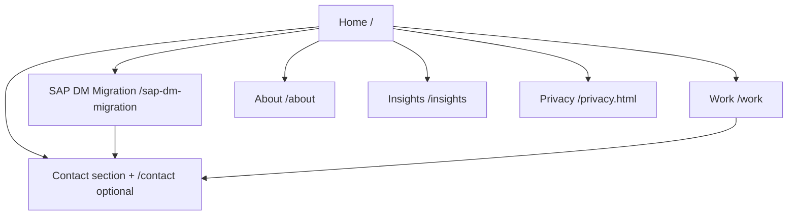

# Dhiphos Website Overhaul
## Technical & Design Specification Document

| Field | Value |
|-------|-------|
| **Version** | 0.9 — Draft for client approval |
| **Date** | 2026-08-25 |
| **Phase** | Step 1 deliverable (Step 2 blocked until explicit approval) |
| **Live site** | https://dhiphos.com |
| **Repository** | Static GitHub Pages (`index.html`, `assets/`, `privacy.html`) |

---

## Document status

| Section | Status |
|---------|--------|
| Current-state audit | **Confirmed** (from codebase + live site) |
| Strategic recommendations | **Proposed** — pending client confirmation |
| Visual & UX direction | **Proposed** — pending client confirmation |
| Information architecture | **Proposed** — pending client confirmation |
| Technical stack (Step 2 preview) | **Proposed** — not implemented |
| Open decisions | **16 items** — see §12 |

**To approve:** Reply with *"I approve the Technical & Design Specification"* (with any amendments). Step 2 implementation begins only after written approval.

---

## 1. Executive summary

Dhiphos is a founder-led industrial software engineering practice specializing in the **SAP Manufacturing Suite** (PEO, DM, MII, ME, BTP), MES/MOM modernization, IIoT/edge, and digital twins. The current website is a well-crafted **single-page developer manifesto** — fast, accessible, consent-aware, and technically sound — but it under-serves **enterprise buyer psychology**: proof of outcomes, migration urgency (MII/ME retirement), structured engagement paths, and lead qualification.

### Recommended strategic shift

Reposition the homepage from *"here is what we build"* to *"here is the problem you face, how we de-risk it, and how we start."* Preserve the builder-to-builder voice and technical credibility; add **buyer-grade trust architecture** (case patterns, engagement model, migration narrative) without becoming a generic SAP SI brochure.

### Recommended IA (hybrid)

```
dhiphos.com/
├── /                     Home (problem → proof → services → team → CTA)
├── /sap-dm-migration     Campaign landing (SEO + MII retirement urgency)
├── /work                 Case studies (anonymized if needed)
├── /about                Founder story, philosophy, credentials
├── /insights/            Optional blog index (Phase 2 content)
├── /privacy.html         Existing privacy + consent
└── /404.html             Branded not-found
```

Single-page scroll can remain the **default home experience** with new routes added as separate HTML pages (still GitHub Pages–compatible, no build step required for v1).

---

## 2. Business context

### 2.1 Company profile (confirmed)

| Attribute | Detail |
|-----------|--------|
| Legal entity | Dhiphos Private Limited |
| Location | Bengaluru, India |
| Model | Founder-led engineering practice, remote-friendly, global clients |
| Domains | Aerospace, automotive, pharmaceutical manufacturing |
| Philosophy | Pure software, hardware-agnostic, builder-to-builder |
| Social | [LinkedIn company page](https://www.linkedin.com/company/dhiphos) |
| Contact | info@dhiphos.com |

### 2.2 Offerings (confirmed — current site)

| Layer | Description |
|-------|-------------|
| **MES/MOM** | Shop-floor execution ↔ enterprise planning bridge |
| **IIoT / Edge** | Telemetry at source; software-defined, hardware-agnostic |
| **Digital twin** | Simulation/prediction before physical changes |
| **Physical AI** | Roadmap: edge inference, predictive modeling, operator-assist |

### 2.3 Services (confirmed — current site)

| Practice area | Focus |
|---------------|-------|
| Specialized implementation | SAP Manufacturing Suite in production |
| Custom integration | Legacy ↔ modern middleware/APIs |
| System architecture | Edge telemetry → ERP |
| App modernization | Cloud-native / edge migration without line stoppage |

### 2.4 Market timing opportunity `[RECOMMENDED]`

SAP ME and MII are being retired (v15.5 final release). Manufacturing IT leaders face a **forced migration decision** toward SAP Digital Manufacturing on BTP. Competitors (io-group, Incture, FORCAM ENISCO) already own this narrative with structured packages and migration landing pages.

**Dhiphos wedge:** Deep hands-on SAP + shop-floor connectivity experience from nearly two decades, delivered as an agile founder-led team — faster decisions, senior engineers on the code, no bench overhead.

---

## 3. Target audience

### 3.1 Primary persona — `[ASSUMED — confirm]`

**"Migration Program Lead"**

| Attribute | Detail |
|-----------|--------|
| Title | Head of Manufacturing IT, MES Program Manager, SAP CoE Lead |
| Company | Mid-to-large discrete/process manufacturer on SAP |
| Trigger | MII/ME end-of-support, S/4HANA program, digital factory initiative |
| Pain | Migration risk, production continuity, integration complexity |
| Success criteria | Phased coexistence, measurable downtime reduction, audit-ready traceability |
| Objection | "You're too small for our global rollout" |

**Site must answer:** Why Dhiphos vs. a large SI? → Senior builders embedded, migration frameworks, aerospace/auto/pharma track record.

### 3.2 Secondary persona — `[ASSUMED — confirm]`

**"Technical Evaluator"**

| Attribute | Detail |
|-----------|--------|
| Title | MES architect, SAP BTP developer, automation engineer |
| Need | Depth on stack (OPC UA, Event Mesh, DM APIs), code-level credibility |
| Conversion | Shares site internally; may not sign SOW |

**Site must answer:** Do these people write real production code? → Builder voice, architecture patterns, technical blog (future).

### 3.3 Anti-persona (do not optimize for)

- Retail POS / ERP shoppers (confusion with unrelated "DhiPOS" brands)
- Hardware-only OT vendors seeking panel builders
- Price-shopping staff augmentation without manufacturing context

---

## 4. Goals & success metrics

### 4.1 Primary conversion goal `[ASSUMED — confirm: Option B]`

**Qualified project inquiry** — multi-field contact capturing manufacturing stack, urgency, and interest area.

| Metric | Baseline (est.) | 90-day target `[TBD with client]` |
|--------|-----------------|-----------------------------------|
| Qualified inquiries / month | Unknown | ≥ 3 |
| Inquiry → discovery call rate | Unknown | ≥ 50% |
| Avg. form completion time | N/A | < 90 sec |

### 4.2 Secondary goals

1. **Credibility for RFP shortlists** — case study page, engagement model
2. **SEO for migration intent** — `/sap-dm-migration` ranking for long-tail terms
3. **LinkedIn → site continuity** — consistent narrative from founder posts

---

## 5. Current-state audit

### 5.1 Strengths (preserve)

| Area | Evidence |
|------|----------|
| Performance | No framework; self-hosted fonts; minimal JS |
| Accessibility | Skip link, ARIA labels, focus styles, reduced-motion respect |
| Privacy | GA4 Consent Mode v2, cookie preferences link, standalone privacy page |
| SEO foundation | Canonical, OG/Twitter cards, JSON-LD Organization, sitemap, robots.txt |
| Brand craft | Geist + amber palette, dark/light auto, distinctive wordmark |
| Progressive enhancement | Form validates client-side; mailto fallback; noscript path |
| Nav UX | IntersectionObserver active-section highlighting |

### 5.2 Gaps (address in overhaul)

| Gap | Impact | Priority |
|-----|--------|----------|
| Email-only contact | Unqualified leads; high back-and-forth | P0 |
| No case studies / metrics | Low enterprise trust | P0 |
| MII→DM urgency absent | Missed SEO + buyer trigger | P0 |
| Offerings = services blur | Cognitive load; unclear "what to buy" | P1 |
| Illustrations disabled | Text walls; weak visual hierarchy | P1 |
| Single page limits SEO depth | No landing pages for high-intent search | P1 |
| "Physical AI" equals proven layers | Credibility risk if not shipped | P2 |
| No engagement packages | Buyer doesn't know how to start | P0 |
| No calendar / CRM integration | Manual scheduling friction | P1 |

### 5.3 Technical debt (minor)

- README says "No tracking" but GA4 is implemented (documentation drift)
- Form `endpoint` empty — relies on mailto
- Illustration assets referenced but commented out in HTML

---

## 6. Competitive positioning

### 6.1 Competitive set

| Competitor | Positioning | Dhiphos counter |
|------------|-------------|-----------------|
| **io-group** | SAP DM + production planning; structured bundles | More agile; founder on the floor; less overhead |
| **Incture** | 18+ years; industry templates; metrics-heavy | Deeper individual expertise; custom architecture |
| **FORCAM ENISCO** | 25+ years; 8-phase methodology | Builder-to-builder vs. process-heavy |
| **Large SAP partners** (Deloitte, Accenture) | Scale, global delivery | Speed, senior ICs, cost efficiency for mid-market |

### 6.2 Differentiation pillars `[RECOMMENDED]`

1. **Migration without production halt** — phased coexistence (aligns with founder LinkedIn content)
2. **Code on the shop floor** — not slideware; MII, DM, BTP in production
3. **Hardware-agnostic software** — integrate what you have
4. **Founder-led accountability** — named expert, not rotating bench

---

## 7. Information architecture & content

### 7.1 Site map



### 7.2 Home page sections (revised order)

| # | Section | Purpose |
|---|---------|---------|
| 1 | **Hero** | Problem-first headline + dual CTA (Inquire / Explore migration) |
| 2 | **Trust strip** | Industries served, SAP products, response-time promise |
| 3 | **Problem** | MII/ME retirement urgency (2–3 sentences + link to landing page) |
| 4 | **How we engage** | Discover → Prove → Scale cards |
| 5 | **Services** | Four practice areas (outcome-oriented copy) |
| 6 | **Offerings layers** | MES, edge, twin (+ roadmap note for Physical AI) |
| 7 | **Selected work** | 2–3 case cards with metrics |
| 8 | **Team / founder** | Photo, bio, philosophy |
| 9 | **Contact** | Qualified inquiry form |
| 10 | **Footer** | Email, LinkedIn, privacy, cookie prefs |

### 7.3 Page: `/sap-dm-migration` `[RECOMMENDED — P1]`

**Purpose:** Capture high-intent search traffic; provide migration-specific narrative.

| Block | Content |
|-------|---------|
| Hero | "MII and ME are retiring. Here's how to migrate without stopping the line." |
| Timeline | SAP support milestones (v15.5 final, evolution kit) |
| Approach | Phased coexistence diagram (SVG) |
| Services mapped | Implementation, integration, architecture, modernization |
| CTA | Same qualified inquiry form with `source=sap-dm-migration` hidden field |
| FAQ | 5–7 questions (cloud vs. on-prem, BTP requirements, timeline) |

### 7.4 Page: `/work`

| Case card fields | Example |
|------------------|---------|
| Industry | Aerospace |
| Challenge | Legacy MII, 40+ machines, no unified telemetry |
| Outcome | "Connected dozens of machines… reduced equipment downtime" `[quantify if possible]` |
| Stack tags | SAP MII, OPC UA, dashboards |
| CTA | "Discuss a similar project" |

**NDA-safe pattern:** Industry + outcome + stack; no client name unless approved.

### 7.5 Content tone & voice

| Do | Don't |
|----|-------|
| Outcome-first headlines | Jargon-heavy chip labels as primary headings |
| Confident sentence case in headings | All-lowercase section titles for buyer-facing blocks |
| Builder credibility ("we work in code and on the floor") | Generic "digital transformation partner" |
| Honest roadmap labeling for Physical AI | Imply shipped AI products |
| Specific SAP product names | Vague "enterprise solutions" |

**Preserve:** Geist Mono for **tags/chips/labels** (technical accent), not for primary H2/H3.

---

## 8. UX & UI design specification

### 8.1 Design principles

1. **Credible minimalism** — clean layout with purposeful proof, not empty minimalism
2. **Progressive disclosure** — hero simplicity; depth available via Work + Migration pages
3. **Dual readability** — scannable for executives; expandable detail for engineers
4. **Performance as trust** — sub-1s LCP on 4G; no layout shift from fonts (keep preload)
5. **Accessible by default** — WCAG 2.2 AA target

### 8.2 Visual system (evolve current tokens)

#### Color `[RECOMMENDED — refine, not replace]`

| Token | Light | Dark | Role |
|-------|-------|------|------|
| `--bg` | `#ffffff` | `#1a1a1a` | Page background (keep) |
| `--fg` | `#333333` | `#ffffff` | Body text (keep) |
| `--muted` | `#888888` | `#888888` | Secondary (keep) |
| `--accent` | `#B45309` | `#F59E0B` | CTAs, markers (keep) |
| `--surface` | `#fafafa` | `#242424` | **New** — card backgrounds |
| `--border` | `#88888833` | `#ffffff1f` | **New** — card borders |

#### Typography (keep three-face system)

| Face | Usage |
|------|-------|
| Geist | Body, display headings |
| Geist Mono | Chips, eyebrows, code, metadata |
| Space Grotesk | Wordmark only (uppercase via CSS) |

#### New components

| Component | Spec |
|-----------|------|
| **Case card** | Surface bg, border, industry tag, outcome metric (large numeral), stack chips |
| **Engagement card** | 3-column grid (desktop), icon/number, title, 2-line description, "Typical duration" |
| **Trust strip** | Horizontal scroll on mobile; industry icons or text labels |
| **FAQ accordion** | `<details>/<summary>` native (no JS) for migration page |
| **Qualified form** | 5 fields max; progressive: email required, rest optional but encouraged |

### 8.3 Hero redesign `[PROPOSED]`

**Current:**
> Industrial software, modernized.

**Proposed:**
> **Migrate your shop floor to SAP Digital Manufacturing — without stopping the line.**

Subhead: Hands-on architecture and implementation across SAP DM, MII, ME, PEO, and BTP. Builder-to-builder. Remote-friendly. Global clients.

**CTAs:**
- Primary: `Start a conversation` → `#contact`
- Secondary: `SAP DM migration guide` → `/sap-dm-migration`

### 8.4 Contact form redesign `[P0]`

Replace single email field with:

| Field | Type | Required |
|-------|------|----------|
| Work email | email | Yes |
| Name | text | Yes |
| Company | text | Yes |
| Primary interest | select: Migration / Implementation / Integration / Architecture / Other | Yes |
| Current stack | text (placeholder: "e.g. SAP MII 15.x, OPC UA, S/4HANA") | No |
| Message | textarea (3 rows) | No |
| Source | hidden (page slug) | auto |

**Backend:** Formspree or Cloudflare Worker → email notification + optional webhook to CRM.

**Fallback:** Retain mailto with pre-filled body if POST fails.

### 8.5 Illustrations & imagery

| Asset | Recommendation |
|-------|----------------|
| Offerings/services diagrams | Re-enable as WebP; add `srcset` for responsive |
| Migration page | New SVG: ERP ↔ DM ↔ Edge ↔ Machines |
| Founder | Professional headshot on About + Home team section |
| OG image | Update to reflect new headline (1200×630) |

### 8.6 Responsive breakpoints

| Breakpoint | Behavior |
|------------|----------|
| `< 640px` | Single column; sticky nav collapses to hamburger **if** nav exceeds 4 items |
| `640–1024px` | 2-column cards |
| `> 1024px` | 3-column engagement; max-width container ~1200px |

**Nav decision:** With 5–6 top-level links, introduce mobile menu (currently all links inline).

### 8.7 Motion

- Respect `prefers-reduced-motion`
- Subtle fade-in on scroll **optional** (CSS only); not required for v1
- No autoplay video

---

## 9. SEO, analytics & compliance

### 9.1 SEO

| Item | Action |
|------|--------|
| Title templates | `{Page} — Dhiphos` / home: current |
| Meta descriptions | Unique per page; migration page targets MII keywords |
| JSON-LD | Add `ProfessionalService` + `FAQPage` on migration page |
| Sitemap | Add new routes |
| Internal linking | Home ↔ Migration ↔ Work |
| Target keywords `[RECOMMENDED]` | SAP DM implementation, MII to DM migration, SAP manufacturing consultant, MES modernization SAP |

### 9.2 Analytics events (GA4)

| Event | Trigger |
|-------|---------|
| `generate_lead` | Form submit success |
| `cta_click` | Hero + section CTAs |
| `outbound_click` | LinkedIn |
| `file_download` | Future lead magnets |

Consent Mode v2 flow **unchanged**.

### 9.3 Compliance

- Privacy page updated if new processors (Formspree, Cal.com)
- Cookie banner unchanged unless new tracking added
- No client logos without written permission

---

## 10. Technical specification (Step 2 preview)

> **Not implemented until spec approval.** This section defines the proposed build approach.

### 10.1 Stack recommendation

| Layer | Recommendation | Rationale |
|-------|----------------|-----------|
| **Markup** | Semantic HTML5 (multi-page) | Keeps GitHub Pages deployment; no build required for v1 |
| **Styles** | CSS custom properties + logical modules in `assets/css/` | Current pattern scales |
| **Scripts** | Vanilla JS (form, nav, analytics) | Already in place; minimal bundle |
| **Forms** | Formspree **or** Cloudflare Worker | Zero-ops; JSON POST hook exists |
| **Optional v2** | Astro or Eleventy | If blog/insights grows beyond 5 pages |

**Recommendation:** Stay **plain static** for v1 launch. Revisit Astro when `/insights` exceeds ~10 posts.

### 10.2 Proposed file structure

```
dhiphos-site/
├── index.html
├── sap-dm-migration.html      # NEW
├── work.html                  # NEW
├── about.html                 # NEW (or merge into index)
├── privacy.html
├── 404.html
├── CNAME
├── robots.txt
├── sitemap.xml
├── manifest.webmanifest
├── docs/                      # Spec + discovery (not deployed)
│   ├── TECHNICAL-AND-DESIGN-SPECIFICATION.md
│   └── DISCOVERY-SESSION-LOG.md
└── assets/
    ├── css/
    │   ├── styles.css         # Core tokens + base
    │   ├── components.css     # NEW — cards, forms, FAQ
    │   └── pages.css          # NEW — page-specific overrides
    ├── js/
    │   ├── script.js          # Form, nav, year
    │   ├── consent.js
    │   └── nav-mobile.js      # NEW — hamburger if needed
    ├── fonts/                 # Unchanged
    └── img/
        ├── logo-*.svg
        ├── og-image.png       # UPDATE
        ├── founder.jpg        # NEW (client-provided)
        └── diagrams/          # SVG migration diagram
```

### 10.3 Shared partials strategy (no build step)

Without a static site generator, shared header/footer will be:

1. **v1 approach:** Copy-paste with HTML comments marking sync blocks (current pattern)
2. **v1.1 optional:** Tiny `<script type="module">` fetch injection for header/footer (progressive; SEO-safe if SSR not needed)

**Recommendation:** Duplicate header/footer in v1 (4 pages max); extract to includes when page count > 5.

### 10.4 Deployment

| Item | Value |
|------|-------|
| Host | GitHub Pages (unchanged) |
| Branch | `main` |
| Domain | `dhiphos.com` via CNAME |
| CI | Optional GitHub Action for HTML validation + Lighthouse |
| Rollback | Git revert on `main` |

### 10.5 Performance budget

| Metric | Target |
|--------|--------|
| LCP | < 2.5s |
| CLS | < 0.1 |
| Total page weight (home) | < 500 KB |
| JS (compressed) | < 15 KB |

### 10.6 Accessibility checklist

- [ ] Color contrast ≥ 4.5:1 body, 3:1 large text
- [ ] Focus visible on all interactive elements
- [ ] Form labels + error announcements (`aria-live`)
- [ ] Mobile menu keyboard trap + escape dismiss
- [ ] Skip link preserved
- [ ] `alt` text on all meaningful images

---

## 11. Implementation phases (Step 2 roadmap)

| Phase | Scope | Depends on |
|-------|-------|------------|
| **2A — Foundation** | IA, shared nav, hero rewrite, engagement cards, form upgrade, Formspree | Spec approval + form endpoint |
| **2B — Proof** | `/work` page, case cards, founder photo | Client content |
| **2C — SEO landing** | `/sap-dm-migration`, FAQ, JSON-LD | Copy approval |
| **2D — Polish** | Illustrations, OG image, mobile nav, Lighthouse pass | — |
| **2E — Integrations** | CRM webhook, Cal.com embed (optional) | Client accounts |

---

## 12. Open decisions (client input required)

| ID | Question | Recommended default |
|----|----------|---------------------|
| D1 | Primary conversion goal | Qualified inquiry (form) |
| D2 | Lead with SAP migration or broad industrial | SAP migration hero + broad offerings |
| D3 | Multi-page vs. single-page | Hybrid (home + 2–3 pages) |
| D4 | Physical AI prominence | Roadmap footnote only |
| D5 | Case study anonymity | Anonymized industry + outcomes |
| D6 | Form backend | Formspree (client creates account) |
| D7 | Calendar booking at launch | No — email first; add Cal.com in 2E |
| D8 | CRM integration | Defer unless client specifies |
| D9 | Visual richness (1–5) | 3 — diagrams + founder photo, no video |
| D10 | Re-enable Gemini illustrations | Yes, optimized WebP |
| D11 | Heading case | Sentence case H2/H3; mono chips for tags |
| D12 | Mobile hamburger nav | Yes (5+ links) |
| D13 | Keep GitHub Pages static | Yes |
| D14 | 90-day success metric | ≥ 3 qualified inquiries/month |
| D15 | Launch content owner | Founder approves copy |
| D16 | Target launch date | `[TBD]` |

Full questionnaire: [DISCOVERY-SESSION-LOG.md](./DISCOVERY-SESSION-LOG.md)

---

## 13. Out of scope (v1)

- Customer portal / authentication
- Pricing calculator or public rate cards
- Full blog CMS with >5 posts at launch
- Multi-language / localization
- E-commerce
- Live chat widget
- SAP partner badge (unless partner status confirmed)

---

## 14. Approval

| Role | Name | Signature / Date |
|------|------|------------------|
| Client (Dhiphos) | | |
| Implementation | Cursor Agent | 2026-08-25 (draft) |

**Approval statement:**

> I approve the Technical & Design Specification v0.9 for Dhiphos website overhaul. Proceed to Step 2 implementation.
>
> Amendments (if any): _______________

---

## Appendix A — Current asset inventory

| Asset | Path | Status |
|-------|------|--------|
| Home page | `index.html` | Live |
| Styles | `assets/css/styles.css` | Live |
| Form handler | `assets/js/script.js` | Live (mailto fallback) |
| Consent | `assets/js/consent.js` | Live |
| GA4 | `G-GHVMTXCPLV` | Live |
| Illustrations | `assets/img/*-light/dark.webp` | Commented out in HTML |
| Fonts | Geist, Geist Mono, Space Grotesk | Self-hosted |

## Appendix B — Competitor reference URLs

- io-group SAP DM: https://www.io-group.com/what-we-do/sap-solutions-digitalization/sap-dm
- Incture SAP DM: https://incture.com/sap-digital-manufacturing-transformation/
- FORCAM ENISCO: https://forcam-enisco.net/en/sap-dm-implementation/
- SAP product page: https://www.sap.com/products/scm/digital-manufacturing.html
