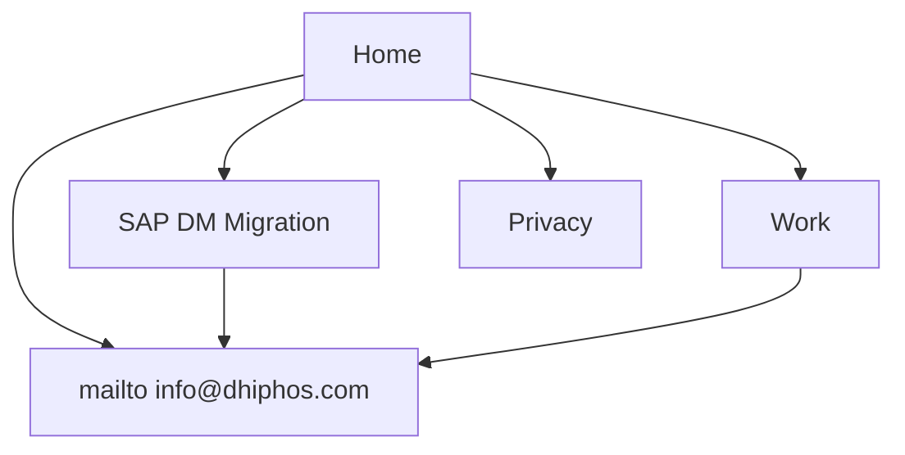

# Dhiphos Website Overhaul
## Technical & Design Specification Document

| Field | Value |
|-------|-------|
| **Version** | **1.0 — Ready for client approval** |
| **Date** | 2026-08-25 |
| **Phase** | Step 1 deliverable (Step 2 blocked until explicit approval) |
| **Live site** | https://dhiphos.com |
| **Repository** | Static GitHub Pages (`index.html`, `assets/`, `privacy.html`) |
| **Discovery log** | [DISCOVERY-SESSION-LOG.md](./DISCOVERY-SESSION-LOG.md) |

---

## Document status

| Section | Status |
|---------|--------|
| Discovery (16 questions) | **Confirmed** via one-by-one dialogue |
| Strategic direction | **Confirmed** |
| Visual & UX direction | **Confirmed** |
| Information architecture | **Confirmed** |
| Technical stack (Step 2 preview) | **Confirmed approach** — not implemented |
| Open decisions | **None** — all locked |

**To approve Step 2:** Reply with *"I approve the Technical & Design Specification"* (with any amendments). Implementation begins only after written approval.

---

## 1. Executive summary

Dhiphos is a founder-led industrial software engineering practice specializing in the **SAP Manufacturing Suite** (PEO, DM, MII, ME, BTP), MES/MOM modernization, IIoT/edge, and digital twins.

**Client-stated problem:** the current site looks **"too" startup** for enterprise buyers.

**Confirmed strategy:** Reposition from engineer manifesto → **buyer-led trust architecture** with migration urgency, Discover→Prove→Scale engagement, hybrid IA (Home + SAP DM migration landing + Work), SVG technical diagrams, and a **qualified mailto inquiry** (form fields → official `info@dhiphos.com`). Preserve forge-amber brand, GitHub Pages static stack, GA4 Consent Mode, and accessibility.

**Secondary goal:** Credibility for referrals / RFP shortlists (structure for proof even though named case assets are not available yet).

---

## 2. Confirmed discovery decisions

| # | Topic | Decision |
|---|-------|----------|
| 1 | Goals | Primary: **qualified inquiry**. Secondary: **RFP / referral credibility** |
| 2 | Personas | **Buyer-led** homepage; influencer depth below + `/work` |
| 3 | Top pain | Looks **too startup** |
| 4 | Positioning | **Hybrid** — migration landing + broader offerings |
| 5 | Proof | **None publishable yet** — proof-ready placeholders only |
| 6 | Benchmarks | **io-group**, **FORCAM ENISCO** |
| 7 | Engagement | **Discover → Prove → Scale** |
| 8 | Physical AI | **Roadmap / secondary** only |
| 9 | Brand | Media **3**, Tone **4** (more executive), Color **1** (keep amber), Scale **3** |
| 10 | IA | **Hybrid** multi-page |
| 11 | Copy | Agent drafts marketing pages; client bio later; **no blog v1** |
| 12 | Imagery | **SVG diagrams**; no stock; **no founder photo v1** |
| 13 | Contact | **Mailto only** (structured fields → pre-filled email) |
| 14 | Constraints | GH Pages, no build, GA4+consent, EN, WCAG 2.2 AA, system dark mode |
| 15 | Success | All metrics; ≥3 qualified emails/month default |
| 16 | Launch | No hard deadline; client-only approval; privacy update only |

---

## 3. Business context

### 3.1 Company profile

| Attribute | Detail |
|-----------|--------|
| Legal entity | Dhiphos Private Limited |
| Location | Bengaluru, India |
| Model | Founder-led engineering practice, remote-friendly, global clients |
| Domains | Aerospace, automotive, pharmaceutical manufacturing |
| Philosophy | Pure software, hardware-agnostic, builder-to-builder |
| Social | [LinkedIn](https://www.linkedin.com/company/dhiphos) |
| Contact | info@dhiphos.com |

### 3.2 Offerings (homepage layers)

| Layer | Prominence |
|-------|------------|
| MES/MOM | Primary |
| IIoT / Edge | Primary |
| Digital twin | Primary |
| Physical AI | **Roadmap footnote / chip only** |

### 3.3 Services

Specialized implementation · Custom integration · System architecture · App modernization — rewritten as **outcome-oriented** copy (not lowercase manifesto labels as primary H3s).

### 3.4 Market wedge

SAP ME/MII retirement → SAP Digital Manufacturing on BTP. Homepage and `/sap-dm-migration` lead with **migration without stopping the line**, informed by io-group / FORCAM narrative patterns but delivered as a lean founder-led practice.

---

## 4. Target audience

### 4.1 Primary — Economic buyer (homepage lead)

**Migration Program Lead / Head of Manufacturing IT / SAP CoE**

Needs: risk reduction, production continuity, clear engagement path, credible partner (not “startup brochure”).

### 4.2 Secondary — Technical influencer

**MES architect / SAP BTP developer / automation engineer**

Needs: stack depth, builder credibility — served in mid-page detail and `/work`.

### 4.3 Anti-persona

Retail POS (DhiPOS confusion), hardware-only OT vendors, pure staff-aug price shoppers.

---

## 5. Goals & success metrics

| Goal | Metric (90 days) |
|------|------------------|
| Qualified inquiries | ≥ 3 emails/month to info@dhiphos.com with useful context |
| Conversations | Discovery calls started from those inquiries |
| SEO | Visibility for SAP DM / MII migration long-tail |
| Credibility | Mentions in RFPs / partner intros |
| Engagement | Improved time-on-site / engagement in GA4 |
| Brand | Client judgment: no longer “too startup” |

---

## 6. Current-state audit (preserve vs. change)

### Preserve

- Static HTML/CSS/JS on GitHub Pages + CNAME
- Self-hosted Geist / Geist Mono / Space Grotesk
- Amber forge palette + `prefers-color-scheme`
- GA4 Consent Mode v2 + privacy page + cookie prefs
- Skip link, ARIA, reduced-motion, IntersectionObserver nav
- Progressive enhancement patterns

### Change

| Gap | Spec response |
|-----|----------------|
| Too startup | Executive sentence-case headlines; trust strip; engagement model; SVG diagrams |
| Email-only thin CTA | Multi-field form → **mailto** with structured body |
| No proof | Placeholder Work cards (industry + outcome template); no fake logos |
| No migration urgency | `/sap-dm-migration` + home problem block |
| Physical AI = peer layer | Demote to roadmap |
| Manifesto IA | Hybrid pages; Discover→Prove→Scale |

---

## 7. Competitive positioning

| Competitor | Take | Dhiphos difference |
|------------|------|-------------------|
| **io-group** | Strong SAP DM narrative, structured offers | Leaner, founder on code/floor |
| **FORCAM ENISCO** | Methodology depth, phases | Same clarity, less process theater |
| Large SIs | Scale | Speed, senior ICs, mid-market fit |

**Pillars:** migration without halt · code on the shop floor · hardware-agnostic software · founder-led accountability.

---

## 8. Information architecture

```
dhiphos.com/
├── /                     Home
├── /sap-dm-migration     Campaign / SEO landing
├── /work                 Case structure (placeholders OK)
├── /privacy.html         Privacy + consent (update processors if any)
└── /404.html             Branded 404
```

Optional later (out of v1): `/about` as separate page (founder bio can live on Home until then), `/insights`.



### Home section order

1. Hero (problem-first, dual CTA)
2. Trust strip (industries, SAP products, response-time)
3. Problem / migration urgency (link to landing)
4. How we engage — Discover → Prove → Scale
5. Services (outcome copy)
6. Offerings layers (+ Physical AI roadmap note)
7. Selected work (placeholder cards)
8. Team / philosophy (text; no photo required)
9. Contact (qualified mailto form)
10. Footer

### `/sap-dm-migration`

Hero · support timeline · phased coexistence SVG · mapped services · FAQ (`<details>`) · same mailto form with `source` in body.

### `/work`

2–3 anonymized **template** cards (Aerospace / Automotive / Pharma) using existing selected-work narrative; mark as representative patterns until client supplies metrics. No logos.

---

## 9. UX & UI design specification

### 9.1 Principles

1. Credible minimalism (not empty manifesto)
2. Buyer scan path first; engineer depth second
3. Performance as trust (static, self-hosted fonts)
4. WCAG 2.2 AA
5. Less “startup”: sentence-case H2/H3; mono chips for tags only

### 9.2 Visual system

**Keep:** `--bg`, `--fg`, `--muted`, `--accent` (`#B45309` / `#F59E0B` dark), Geist triad, diamond markers optional.

**Add:** `--surface`, `--border` for engagement/work cards (subtle — cards only where interaction/grouping needs them).

**Imagery:** Custom SVG diagrams only. No stock. No founder photo in v1. Do not re-enable Gemini collage illustrations as primary (too startup-AI).

### 9.3 Hero (proposed copy — editable at implementation)

**Headline:** Migrate your shop floor to SAP Digital Manufacturing — without stopping the line.

**Subhead:** Hands-on architecture and implementation across SAP DM, MII, ME, PEO, and BTP. Builder-to-builder. Remote-friendly. Global clients.

**CTAs:** Start a conversation → `#contact` · SAP DM migration → `/sap-dm-migration`

### 9.4 Contact — mailto pattern (confirmed)

UI still looks like a form (Name, Work email, Company, Interest select, Current stack optional, Message optional). On submit:

1. Client-side validate required fields  
2. Build `mailto:info@dhiphos.com?subject=…&body=…` with structured fields  
3. Open mail client; status: “Opening your email client…”  
4. Noscript: show direct email link  

**No Formspree / Worker / CAPTCHA in v1.** Privacy page: note that inquiry uses visitor’s mail client to contact `info@dhiphos.com` (no form processor).

### 9.5 Engagement cards

| Stage | Typical framing |
|-------|-----------------|
| **Discover** | Fit-gap / roadmap workshop |
| **Prove** | Bounded PoC on one line/cell |
| **Scale** | Embedded implementation or fixed-scope SOW |

### 9.6 Responsive & nav

With 4–5 top links, add **mobile nav** (hamburger) under ~640px. Desktop: existing sticky topnav pattern.

### 9.7 Motion

Respect `prefers-reduced-motion`. Optional subtle CSS fade only; no video.

---

## 10. SEO, analytics, compliance

| Item | Action |
|------|--------|
| Titles | `{Page} — Dhiphos` |
| Migration SEO | MII/ME retirement + SAP DM implementation language |
| JSON-LD | Organization (keep) + FAQPage on migration |
| Sitemap / robots | Add new HTML routes |
| GA4 | Keep Consent Mode; events: `cta_click`, mailto intent if measurable |
| Privacy | Update for mailto-only contact (no form SaaS); cookie prefs unchanged |
| Legal | Privacy update only (per client) |

---

## 11. Technical specification (Step 2 — after approval)

### 11.1 Stack

| Layer | Choice |
|-------|--------|
| Hosting | GitHub Pages + `dhiphos.com` |
| Markup | Multi-page semantic HTML |
| CSS | Tokens + modular CSS (`styles.css` + components) |
| JS | Vanilla (form→mailto, nav, year, consent) |
| Build | **None** for v1 |
| Forms | Mailto only |
| CMS / blog | Out of scope v1 |

### 11.2 File structure

```
dhiphos-site/
├── index.html
├── sap-dm-migration.html
├── work.html
├── privacy.html          # update contact/privacy wording
├── 404.html
├── CNAME
├── robots.txt
├── sitemap.xml
├── manifest.webmanifest
├── docs/
│   ├── TECHNICAL-AND-DESIGN-SPECIFICATION.md
│   └── DISCOVERY-SESSION-LOG.md
└── assets/
    ├── css/
    │   ├── styles.css
    │   └── components.css    # cards, form, FAQ, mobile nav
    ├── js/
    │   ├── script.js         # mailto builder + nav observer
    │   ├── consent.js
    │   └── nav-mobile.js
    ├── fonts/                # unchanged
    └── img/
        ├── logo-*.svg
        ├── og-image.png      # refresh for new headline
        └── diagrams/         # SVG migration + stack diagrams
```

### 11.3 Performance budget

LCP &lt; 2.5s · CLS &lt; 0.1 · Home &lt; 500 KB · JS &lt; 15 KB gzipped.

### 11.4 Accessibility

Contrast, focus, labels, `aria-live` on form status, keyboard mobile nav, skip link, SVG titles/`aria-hidden` as appropriate.

### 11.5 Deployment

Push to `main` → GitHub Pages. Feature work on `cursor/<name>-2a80` → PR → client merge.

---

## 12. Implementation phases (Step 2)

| Phase | Scope |
|-------|-------|
| **2A** | Shared nav, hero rewrite, trust strip, Discover→Prove→Scale, mailto form upgrade, tone pass (less startup) |
| **2B** | `/work` placeholders + SVG diagrams |
| **2C** | `/sap-dm-migration` + FAQ + JSON-LD |
| **2D** | Mobile nav, OG image, privacy update, Lighthouse/a11y pass |
| **2E** | Optional later: Formspree/domain mail, Cal.com, founder photo, real case metrics |

---

## 13. Out of scope (v1)

- Form SaaS / transactional email From domain  
- Calendar, CRM, live chat, newsletter  
- Blog / CMS  
- Founder photography  
- Named client logos / fake metrics  
- Stock photography  
- Customer portal, pricing calculator, i18n  
- Leaving GitHub Pages  

---

## 14. Approval

| Role | Name | Signature / Date |
|------|------|------------------|
| Client (Dhiphos) | | |
| Spec author | Cursor Agent | 2026-08-25 (v1.0) |

**Approval statement (copy/paste):**

> I approve the Technical & Design Specification v1.0 for the Dhiphos website overhaul. Proceed to Step 2 implementation.
>
> Amendments (if any): _______________

---

## Appendix A — Asset inventory

| Asset | Status |
|-------|--------|
| `index.html` + `assets/css/styles.css` | Evolve |
| `assets/js/script.js` | Extend for multi-field mailto |
| `assets/js/consent.js` | Keep |
| GA4 `G-GHVMTXCPLV` | Keep |
| Gemini webp illustrations | Do not use as primary hero/section art |
| New SVG diagrams | Create in Step 2 |

## Appendix B — Competitor refs

- https://www.io-group.com/what-we-do/sap-solutions-digitalization/sap-dm  
- https://forcam-enisco.net/en/sap-dm-implementation/  
- https://www.sap.com/products/scm/digital-manufacturing.html  
